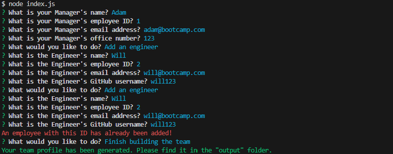
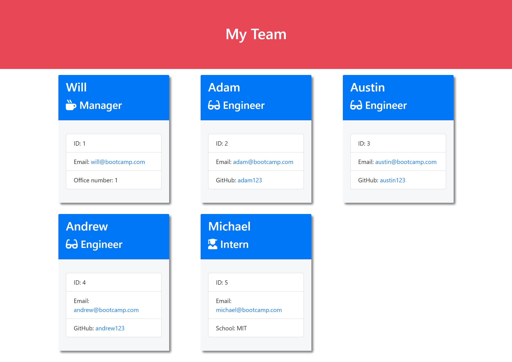

# Team Profile Generator

## Description
This app is an easy-to-use Node.js application. It takes in information about employees on a software engineering team, then generates an HTML webpage that displays summaries for each person. It provides quick access to basic informations, such as GitHub profile, email address, ID, and name of team members.

## Installation
The app itself doesn't require installation, however to be able to use it [Node.js](https://nodejs.org/en) needs to be installed on your computer.

## How to use
1. Clone this repository to your local machine.
2. Execute `npm install` or `npm i` in the project folder to get the necessary dependencies:
    - [Chalk](https://github.com/chalk/chalk) to display colorized console messages.
    - [Inquirer](https://www.npmjs.com/package/inquirer) to display the questions on the console.
    - [Jest](https://www.npmjs.com/package/jest) to be able to run tests.
3. Execute `node index.js` to launch the Team Profile Generator.
4. Answer the questions about the Team Manager. They all are mandatory to answer.
5. Once the questions are answered, you will be able to choose what you would like to do:
    - Add an engineer
    - Add an intern
    - Finish building the team
6. If you choose to add an Intern or an Engineer, further questions will appear in regards to the employee. They all are mandatory to answer.
7. Once the questions are answered, the above menu will be displayed again to choose what to do next.
8. If you choose to finish building your team, you can find the generated HTML file in the `output` folder within the project folder.

## Tests
If you would like to run the provided tests on the application, execute the `npm run test` or `npm test` command.

## Screenshots
Screenshot of questions on the console with colorized messages\

Screenshot of the generated HTML file
